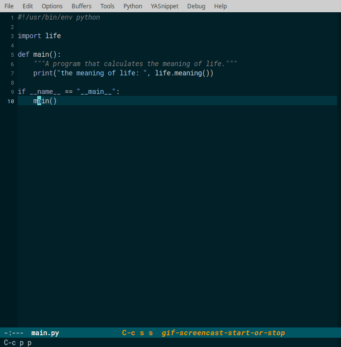
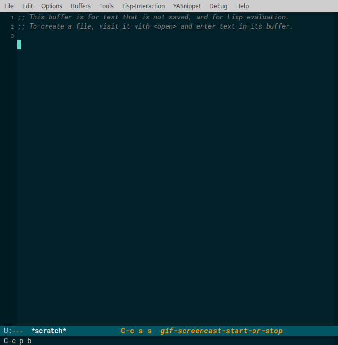
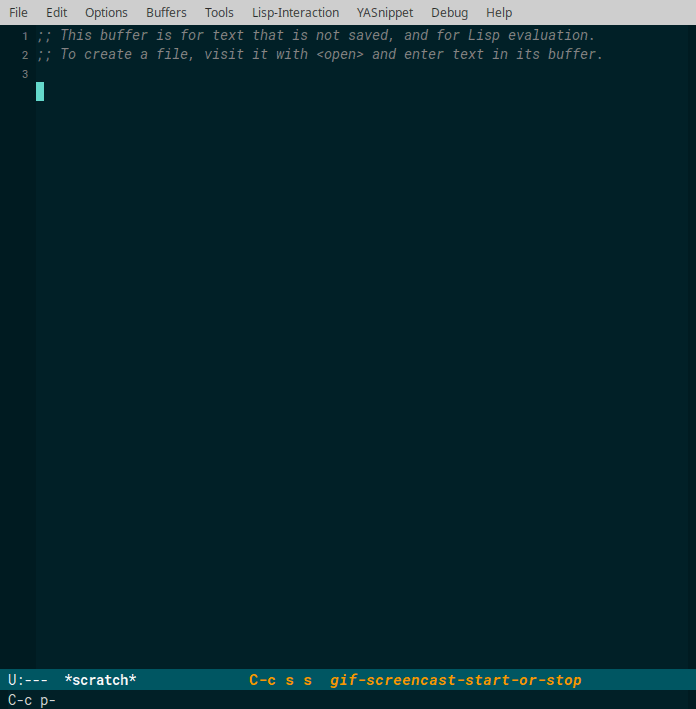

# postrace

Leave trace points to navigate back and forth examining important code paths.

`postrace` is similar in spirit to Emacs' [global mark
ring](https://www.gnu.org/software/emacs/manual/html_node/emacs/Global-Mark-Ring.html),
but offers a more intuitive interface for browsing/navigating buffer positions.
It is particularly useful when examining code paths.

postrace provides commands to push buffer positions onto a position stack and
navigate back and forth between these positions, with the position under the
cursor being previwed in the active window.  The functionality is primarily
offered through two interactive commands:

- `postrace-push`: pushes the buffer position (marker) at point to the
  position stack.

- `postrace-browse`: enters "browse mode".  The position stack is displayed
  and can be browsed in the minibuffer.  The position under the cursor is
  previewed in the active window.  The `postrace-browse-map` has the
  following default keybindings:

  - `up`/`C-p`:   move one step up the position stack.
  - `down`/`C-n`: move one step down the position stack.
  - `RET`: jump to the position under the cursor.
  - `C-g`/`escape`: exit the minibuffer and return to whichever buffer was
    active when `postrace-browse` was issued.
  - `M-up`/`M-p`:   move the position under the cursor one step up.
  - `M-down`/`M-n`: move the position under the cursor one step down.
  - `delete`: remove the position under the cursor from the position stack.

## Screenshots

This animation illustrates how positions are pushed onto the stack with
`postrace-push` (bound to `C-c p p` in the sample) and how the position stack is
browsed with `postrace-browse` (bound to `C-c p b` in the sample).



While in "browse mode", `RETURN` brings you to the position under cursor.



You can rearrange stack items in "browse mode" with `M-<up>/M-<down>`:


You can delete stack items in "browse mode" with `<delete>`:



## Install

- From MELPA (or MELPA stable) via:

        (require 'package)
        (add-to-list 'package-archives
                     '("melpa" . "https://melpa.org/packages/"))

  Then issue:

        M-x package-refresh-contents
        M-x package-install RET postrace

- Via `use-package` (note: also sets keybindings):

        (use-package postrace
          :ensure t
          :bind (("C-c p p" . postrace-push)
                 ("C-c p b" . postrace-browse)))

- By adding `postrace.el` to your `~/.emacs.d/lisp/`:

        (add-to-list 'load-path "~/.emacs.d/lisp/")
        (require 'postrace)

## Develop

Run tests:

``` bash
make test
```

Start up a clean slate Emacs installation with `pos-stack` installed.

``` bash
make emacs
```

This is useful to try out functions in a clean environment.
